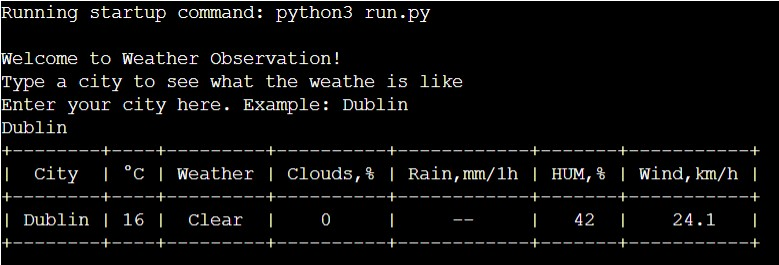
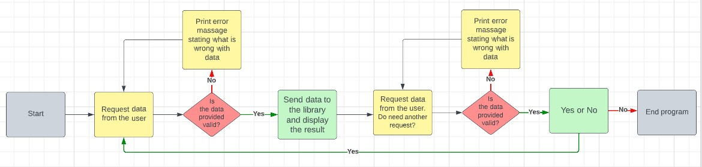
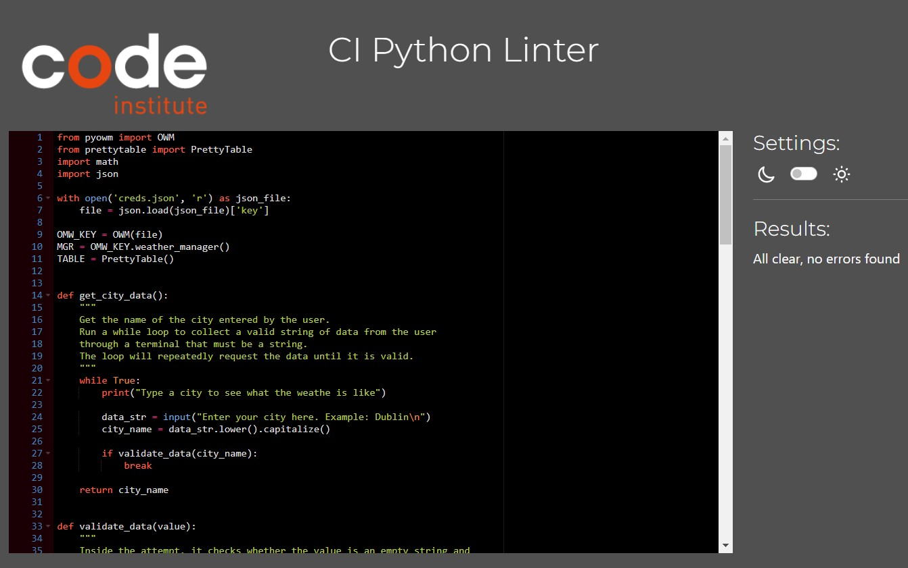

# WEATHER OBSERVATION
---

Weather Observation is a Python terminal program that runs on the Code Institute mock terminal on Heroku.

Users can view the weather in one city or in several at once.
The program will be useful for people who travel and those who want to compare the weather with their city.

[Here is the live version of my project.](https://weather-observation.herokuapp.com/)

## FEATURES
---
* EXISTING FUNCTIONS
    - To see the weather in a city, you need to enter the name of the city.
    The name of the city can be entered with both lowercase and uppercase letters.
        
    - The program allows you to see the following weather data:
        + Temperature in degrees Celsius;
        + Weather - the state of the sky: sun, clouds, raine.
        + Clouds, % - the percentage of cloudiness in the sky is from 0 to 100%. Where 0 is it has no clouds and 100% is completely cloudy sky, sun isn't visible.
        + Raine, mm/1h - This id how much raine fell in milimeters in one hour. If it shows -- it means that it has not rained in the last hour.
        + HUM, %  - This is humidity, measured as a percentage.
        + Wind, km/h  - wind speed in kilometers per hour.
    - To see the weather in several cities at the same time: after requesting the application "Would you like to see the weather in another city?", answer the letter y - YES and enter the name of another city.
        
    - The program allows you to see the weather of up to ten cities at the same time.
        
    - Input validation
        + The program checks on an empty string.
        + The program checks on numbers and special characters.
        + The program checks on spaces.
        + The program checks for input of the city name with an error.
        + The program checks when requesting "Would you like to see the weather in another city?" a character other than y -YES or n - NO.

## DATA MODEL
---
* Logical structure of WEATHER OBSERVATION:

    

* To create the program, I decided to use object-oriented programming and used functions, loops, try statement and if else statement.

* First, the program greets the user and asks to enter the name of the city.

* The city value entered by the user will be checked for correctness. If the value is not correct, it will indicate a problem and ask to enter again.

* The value is then sent to a function that receives weather data from the PyOWM library. Temperature data is rounded to the nearest whole number and wind speed is rounded to the tenth decimal place.

* The data is written to a list and the PrettyTable library is used to display the weather data in tabular form.

* After that, another function will ask the user "Would you like to see the weather in another city?". The user must answer YES or NO.

* The input method receives input values from the user and another function checks them to see if they are correct.

* If the user selects YES, the program will start from the beginning. If NO, the program will end.

* The program allows you to view the weather of up to ten cities at the same time, after which the program ends.

## TESTING
---
| have manually tested this project by doing the following:

* Passed the code through a PEP8 linter and confirmed there are no problems.
    
* Given invalid inputs: numbers, empty strings, special characters, entering the name of the city with an error.
* Tested in my local terminal and the Code Institute Heroku terminal.

## BUGS
---
* SOLVED BUGS
    - When I was writing the project, I got an error that the WHILE loop was constantly looping. This has already been fixed by adding the Break keyword where necessary.
* REMAINING BUGS
    - No bugs remaining.
* VALIDATOR TESTING
    - PEP8
        + No errors were returned from PEP8online.com